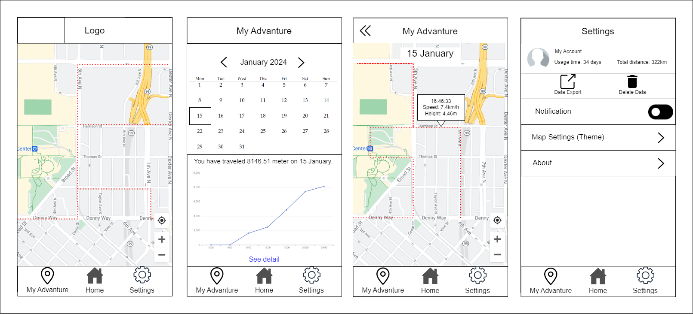
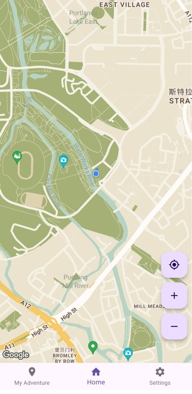
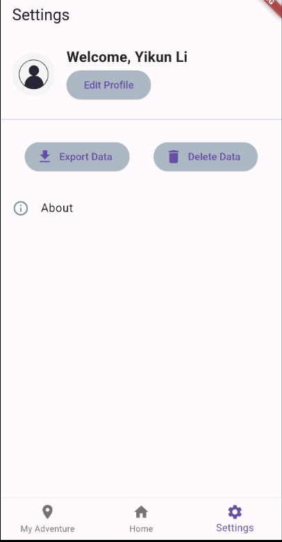
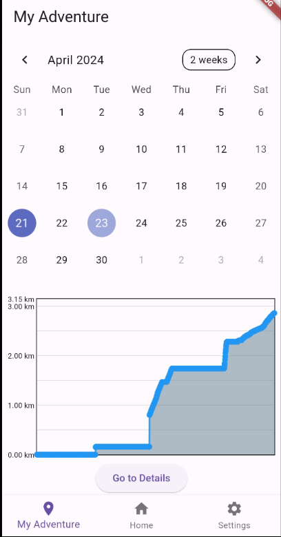
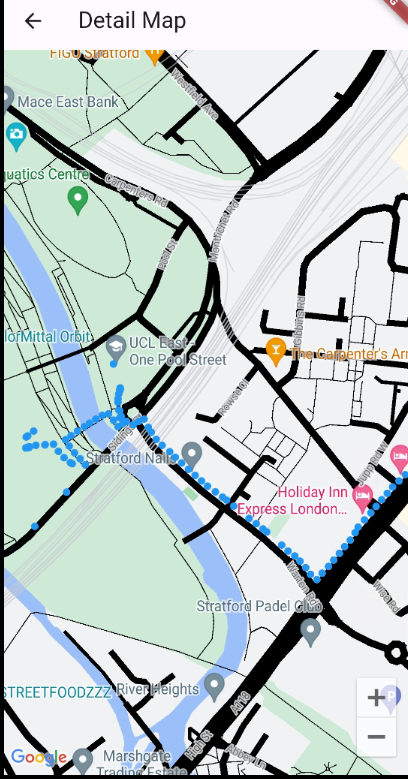

# Journey Tracker

This is an application that helps you recall travel routes.

#### Journey Tracker aims to enhance user experience by providing location tracking and data management functionalities, primarily helping users record and monitor their daily travel routes for better planning and analysis of their journeys.

Landing page: https://yikunli9.github.io/Jouney-Tracker/

which source code in landing_page_sourcecode brunch.

This application is for those who like James Walker:


## Wireframe




## Screenshots


<center>   
   
<br>    
<div style="color:orange; border-bottom: 1px solid #d9d9d9;    display: inline-block;    color: #999;    padding: 2px;">
Home Page
</div> 
</center>


<center>   
   
<br>    
<div style="color:orange; border-bottom: 1px solid #d9d9d9;    display: inline-block;    color: #999;    padding: 2px;">
Setting Page
</div> 
</center>

<center>   
   
<br>    
<div style="color:orange; border-bottom: 1px solid #d9d9d9;    display: inline-block;    color: #999;    padding: 2px;">
Adenture Page - Chart
</div> 
</center>

<center>   
   
<br>    
<div style="color:orange; border-bottom: 1px solid #d9d9d9;    display: inline-block;    color: #999;    padding: 2px;">
Adenture Page - Map
</div> 
</center>


## Demo Video

This is a simple and short demo video to show main functions:

https://github.com/YikunLi9/Jouney-Tracker/assets/146270655/14cfbcd2-f9a9-4b36-922d-fd2fd5f6e250


## About the Application

### Plugins & Dependencies

```yaml
  cupertino_icons: ^1.0.2
  permission_handler: ^11.3.1
  location: ^6.0.1
  table_calendar: ^3.1.1
  fl_chart: ^0.67.0
  sqflite: ^2.3.2
  path_provider: ^2.1.3
  intl: ^0.19.0
  google_maps_flutter: ^2.5.3
  csv: ^6.0.0
```


## Get Started

1. [Install and setup Flutter](https://docs.flutter.dev/get-started/install)

2. Clone the repo:

   ```shell
   git clone https://github.com/YikunLi9/Jouney-Tracker.git
   cd Journey-Tracker
   ```

3. Run the application

   ```shell
   flutter run
   ```

Or you can also just  download the apk in releases:
[Releases · YikunLi9/Jouney-Tracker (github.com)](https://github.com/YikunLi9/Jouney-Tracker/releases)


##  Contact  Author

If you want to contribute to this project, please contact:
Yikun Li (yikun.li.22@ucl.ac.uk)


## License

```
MIT License

Copyright (c) 2024 Yikun Li

Permission is hereby granted, free of charge, to any person obtaining a copy
of this software and associated documentation files (the "Software"), to deal
in the Software without restriction, including without limitation the rights
to use, copy, modify, merge, publish, distribute, sublicense, and/or sell
copies of the Software, and to permit persons to whom the Software is
furnished to do so, subject to the following conditions:

The above copyright notice and this permission not
```
